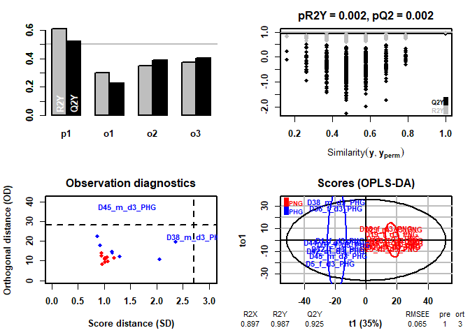

statistical analysis and visualization of lipidomics data
================
BS
10/05/2023

## load libraries

``` r
library(tidyverse)
library(ggrepel)
library(circlize)
library(cowplot)
library(ggpubr)
library(ropls) 
library(xlsx)
```

## load data

``` r
lipidomics_data   <- read.delim("lipids.txt", sep = "\t", header = T) 
conditions        <- read.delim("Conditions.txt",  sep = "\t", header = T)
```

### clean-up data

``` r
# lipid species
lipid_species_tidy <- lipidomics_data %>% 
  filter(Type != "Lipid class") %>% 
  select(Lipid, starts_with("D"))

# lipid class
lipid_class_tidy <- lipidomics_data %>% 
  filter(Type == "Lipid class") %>% 
  select(Lipid, starts_with("D"))
```

## differential abundance analysis using 2 way ANOVA (lipid species)

### log2 transform data

``` r
data_stat <- lipid_species_tidy %>% 
      mutate(across(where(is.numeric), ~ log2(.x)))
```

### fold-change calculation

``` r
fc_function <- function(data, conditions_data, condition_name, compared_to, id_name, values_log) {
  
  # should values be log transformed?
  if (values_log == TRUE) {
    data_long <- data %>% 
    pivot_longer(names_to = "Bioreplicate", values_to = "Intensity", -!!as.symbol(id_name)) %>%
    left_join(conditions_data)
  }
  
  if (values_log == FALSE) {
    data_long <- data %>% 
    pivot_longer(names_to = "Bioreplicate", values_to = "Intensity", -!!as.symbol(id_name)) %>%
    mutate(Intensity = log2(Intensity)) %>% 
    left_join(conditions_data)
  }
  
  #fold-change calculation    
    data_fc <- data_long %>% 
    group_by(!!as.symbol(id_name), !!as.symbol(condition_name)) %>% 
    summarise(grp_mean = mean(Intensity, na.rm=T)) %>% 
    ungroup() 
  
    
  if (compared_to %in% unique(data_fc[[2]][2])) {
    data_fc <- data_fc %>% 
     select(-all_of(condition_name)) %>% 
     group_by(!!as.symbol(id_name)) %>% 
     mutate(l2fc=grp_mean-lag(grp_mean)) %>% 
     select(-grp_mean)  %>% 
     drop_na()
     }
  
   else{
    data_fc <- data_fc  %>% 
    select(-all_of(condition_name)) %>%  
    group_by(!!as.symbol(id_name))  %>% 
    mutate(l2fc=grp_mean-lead(grp_mean)) %>% 
    select(-grp_mean)   %>% 
    drop_na()
     }
    
    cat(paste("positive fold change means up in", compared_to, sep=" ")) 
    
    return(data_fc)
    
    }

# calculate fold-change separately for group and sex
l2fc_group <- fc_function(data_stat, condition = "Group", conditions_data = conditions,
                          compared_to  = "PHG", values_log= T, id_name = "Lipid")
```

    ## Joining with `by = join_by(Bioreplicate)`
    ## `summarise()` has grouped output by 'Lipid'. You can override using the
    ## `.groups` argument.

    ## positive fold change means up in PHG

``` r
l2fc_sex <- fc_function(data_stat, condition = "Sex", conditions_data = conditions,
                          compared_to  = "F", values_log= T, id_name = "Lipid")
```

    ## Joining with `by = join_by(Bioreplicate)`
    ## `summarise()` has grouped output by 'Lipid'. You can override using the
    ## `.groups` argument.

    ## positive fold change means up in F

``` r
# merge fold-changes
l2fc_lipids <- l2fc_group %>% 
  rename("l2fc group (PHG/PNG)" = l2fc) %>% 
  left_join(l2fc_sex) %>% 
  rename("l2fc sex (F/M)" = l2fc) 
```

    ## Joining with `by = join_by(Lipid)`

### 2 way anova

#### perform anova analysis

##### define functions that performs 2 way anova

``` r
two_way_anova_fn <- function(data, id_name, conditions_file, adjust_p_value, p_adj_method, l2fc_data, add_l2fc) {
  
  data_anova  <- data %>% 
          pivot_longer(names_to = "Bioreplicate", 
          values_to = "Value", -all_of(id_name)) %>% 
          left_join(conditions_file) %>% 
          drop_na(Value) %>% 
          group_by(!!as.symbol(id_name)) %>% 
          summarise(`p-value` = 
          summary(aov(Value ~ Group*Sex))[[1]][["Pr(>F)"]][1:3]) 
  
  # correct all resulting p-values (pool) for multiple hypothesis testing
  if (adjust_p_value == TRUE) {
    
  data_anova$`Adjusted p-value`  <- p.adjust(data_anova$`p-value`, method = p_adj_method)
  # prepare empty data frame with proper comparisons
  anova_factors <- as.data.frame(rep(c("group (PHG/PNG)", "sex (F/M)", "group:sex"), length = nrow(data_anova)))
  # rename column 
  names(anova_factors) <- "Comparison"
  
  # final anova results
  anova_results  <- as.data.frame(cbind(data_anova, anova_factors)) %>% 
  pivot_wider(names_from = Comparison, 
                          values_from = c(`p-value`, `Adjusted p-value`), all_of(id_name), names_sep = " ") 
    
  }
  
  if (adjust_p_value == FALSE) {
  anova_factors <- as.data.frame(rep(c("p-value group (PHG/PNG)", "p-value sex (F/M)", 
                                       "p-value group:sex"), length = nrow(data_anova)))
  # rename column 
  names(anova_factors) <- "Comparison"
  
  # final anova results
  anova_results  <- as.data.frame(cbind(data_anova, anova_factors)) %>% 
  pivot_wider(names_from = Comparison, 
                          values_from = `p-value`, all_of(id_name), names_sep = " ") 
    
  }
  # add fold changes
  if (add_l2fc == TRUE) {
    anova_results  <- anova_results  %>% 
       left_join(l2fc_data)
  }
  return(anova_results)
  }
```

##### significance of lipidome changes with 2 way anova

``` r
anova_results <- two_way_anova_fn(data = data_stat, id_name = "Lipid", 
                                  conditions_file = conditions, 
                                  p_adj_method = "BH", adjust_p_value = T,  
                                  add_l2fc = T, l2fc=l2fc_lipids)
```

    ## Joining with `by = join_by(Bioreplicate)`

    ## Warning: Returning more (or less) than 1 row per `summarise()` group was deprecated in
    ## dplyr 1.1.0.
    ## ℹ Please use `reframe()` instead.
    ## ℹ When switching from `summarise()` to `reframe()`, remember that `reframe()`
    ##   always returns an ungrouped data frame and adjust accordingly.
    ## Call `lifecycle::last_lifecycle_warnings()` to see where this warning was
    ## generated.

    ## `summarise()` has grouped output by 'Lipid'. You can override using the
    ## `.groups` argument.

    ## Warning: Specifying the `id_cols` argument by position was deprecated in tidyr 1.3.0.
    ## ℹ Please explicitly name `id_cols`, like `id_cols = all_of(id_name)`.
    ## Call `lifecycle::last_lifecycle_warnings()` to see where this warning was
    ## generated.

    ## Joining with `by = join_by(Lipid)`

##### clean-up anova results

``` r
# final anova results
anova_results  <- anova_results %>% 
  left_join(lipidomics_data %>% select(Lipid, Type)) %>% 
  select("Lipid", "Type", "l2fc group (PHG/PNG)", "p-value group (PHG/PNG)", 
         "Adjusted p-value group (PHG/PNG)", "l2fc sex (F/M)", "p-value sex (F/M)", 
         "Adjusted p-value sex (F/M)", "p-value group:sex", "Adjusted p-value group:sex") %>% 
  arrange(-desc(`Adjusted p-value group (PHG/PNG)`)) 


# separately significant factors and interactions
# significant by group
anova_results_group <- anova_results %>% 
  select(1:5) %>% 
  filter(`Adjusted p-value group (PHG/PNG)` <= 0.05 & abs(`l2fc group (PHG/PNG)`) > log2(1.5)) %>% 
          mutate(`Differentially abundant` = case_when(
                 `l2fc group (PHG/PNG)` >  log2(1.5)  ~  "increased in PHG",
                 `l2fc group (PHG/PNG)` < -log2(1.5)  ~  "decreased in PHG",
             TRUE ~ "n.s."
           )) %>% 
  arrange(desc(`l2fc group (PHG/PNG)`)) 


# significant by sex
anova_results_sex <- anova_results %>% 
  select(1:2, 6:8) %>% 
  filter(`Adjusted p-value sex (F/M)` <= 0.05 & abs(`l2fc sex (F/M)`) > log2(1.5)) %>% 
          mutate(`Differentially abundant` = case_when(
                 `l2fc sex (F/M)` >  log2(1.5)  ~  "increased in F",
                 `l2fc sex (F/M)` < -log2(1.5)  ~  "decreased in F",
             TRUE ~ "n.s."
           )) %>% 
  arrange(desc(`l2fc sex (F/M)`)) 


# interaction
anova_results_int <- anova_results %>% 
  select(1:2, 9, 10) %>% 
  filter(`Adjusted p-value group:sex` <= 0.05) %>% 
  arrange(desc(`Adjusted p-value group:sex`))
```

#### define functions that performs 2 way anova Tukey’s honest significance difference (interaction significant proteins)

``` r
tkhsd_fn <- function(data, id_name, conditions_file, numeric_data) {
  
  # prepare data
  data_tukey <- data %>% 
              select(all_of(id_name)) %>%
              left_join(data_stat) %>% 
              pivot_longer(names_to = "Bioreplicate", values_to = "Intensity", 
                           -all_of(id_name)) %>% 
              left_join(conditions_file) %>% 
    drop_na(Intensity)
  
  # for loop. for each feature which showed significant interaction from
  # 2 way anova, THSD is calculated. significant pairs are extracted
  # make an empty list, where to each feature significant interactions will be assigned
 
   my_vec <- list()
  
  # for which feature
  
  sig_hits <- unique(data_tukey[[id_name]])
  
  # for loop
  for (i in sig_hits) {
    sub_df              <- data_tukey[data_tukey[[id_name]] %in% i,]
    anova_model         <- aov(data= sub_df,  Intensity ~ Group*Sex)
    anova_tukey         <- TukeyHSD(anova_model)
    tuk_interactions    <- anova_tukey[3][[1]] %>% 
    as.data.frame() %>% 
    rownames_to_column() %>% 
    filter(`p adj` < 0.05) %>% 
    select(rowname)
    tuk_interactions_t  <- t(tuk_interactions)
    sig_tuk_interaction <- matrix(apply(tuk_interactions_t,1,paste,collapse=";"),
                                nrow=1)
    my_vec[i] <- sig_tuk_interaction
  }
 
  # final data with anova and THSD statistics
  tkhsd <- list()
  tkhsd[[1]] <- anova_results_int %>% 
               left_join(my_vec %>% 
               unlist() %>% 
               as.data.frame() %>% 
               rownames_to_column("parameter") %>% 
               rename_all(~str_replace(., "parameter", id_name)) %>% 
               rename(`THSD pair` = 2))
  
  
  # data for interaction plot
  tkhsd[[2]] <- numeric_data %>%  
  left_join(tkhsd[[1]]) %>% 
  drop_na(`THSD pair`) %>% 
  select(1:ncol(data_stat)) %>% 
  pivot_longer(values_to = "Intensity", names_to = "Bioreplicate", -all_of(id_name)) %>% 
  left_join(conditions_file) %>% 
  mutate(joinedgr = str_c(Group, Sex, sep = "_")) %>% 
  group_by(!!as.symbol(id_name), joinedgr) %>% 
  summarise(mean = mean(Intensity, na.rm = T), 
            sd = sd(Intensity, na.rm = T), t.score = qt(p=0.05/2, 
            df=length(conditions_file$Bioreplicate),lower.tail=F), 
            ci = t.score * sd ) %>% 
  ungroup() %>% 
  separate(joinedgr, c("Group", "Sex")) 
  
  return(tkhsd)
}
```

##### THSD of Lipid interactions

``` r
anova_results_int_tuk <- tkhsd_fn(data = anova_results_int,  id_name = "Lipid", numeric_data = data_stat, conditions_file = conditions)
```

    ## Joining with `by = join_by(Lipid)`
    ## Joining with `by = join_by(Bioreplicate)`
    ## Joining with `by = join_by(Lipid)`
    ## Joining with `by = join_by(Lipid)`
    ## Joining with `by = join_by(Bioreplicate)`
    ## `summarise()` has grouped output by 'Lipid'. You can override using the
    ## `.groups` argument.

## volcano plot

### prepare data for the volcano plot

``` r
data_volcano <- anova_results %>% 
                mutate(significant = case_when(
                `Adjusted p-value group (PHG/PNG)` < 0.05 & `l2fc group (PHG/PNG)` > log2(1.5) | `Adjusted p-value group (PHG/PNG)` < 0.05 & 
                `l2fc group (PHG/PNG)` < -log2(1.5) ~ "+", TRUE ~ "n.s."),
                diff_abundant = case_when(
                `Adjusted p-value group (PHG/PNG)` < 0.05 & `l2fc group (PHG/PNG)` > log2(1.5)      ~  "Increased_in_PHG",
                `Adjusted p-value group (PHG/PNG)` < 0.05 & `l2fc group (PHG/PNG)`     < -log2(1.5) ~  "Decreased_in_PHG",
             TRUE ~ "n.s."
           )) 
```

### plot volcano plot

``` r
plot_volcano <- ggplot(data_volcano %>%   
                         mutate(Type_new = case_when(Type == "Phosphatidylcholines" ~ "Phosphatidylcholines",
                                                     Type == "Diacylglycerols"      ~ "Diacylglycerols",
                                                     Type == "Triacylglycerols"     ~ "Triacylglycerols",
                                                     TRUE                           ~ "Others")) %>% 
                       arrange(desc(diff_abundant)), 
                       mapping = aes(x = `l2fc group (PHG/PNG)`, y = -log10(`p-value group (PHG/PNG)`), 
                                     fill=Type_new, label = Lipid, alpha = Type_new))+
         geom_point(aes(shape = diff_abundant, size = diff_abundant), stroke = 0.25)+
         scale_fill_manual(values=c("Phosphatidylcholines" = "#6A3D9A", 
                                    "Diacylglycerols"      = "#B2DF8A",      
                                    "Triacylglycerols"     = "#E31A1C",
                                    "Others"               = "grey"))+
         scale_shape_manual(values = c('Increased_in_PHG' = 24, 'Decreased_in_PHG' = 25, "n.s." = 21)) + 
         scale_size_manual(values = c('Increased_in_PHG' = 2.5, 'Decreased_in_PHG' = 2.5, "n.s." = 2)) + 
         scale_alpha_manual(values =c("Phosphatidylcholines" = 1, 
                                    "Diacylglycerols"        = 1,      
                                    "Triacylglycerols"       = 1,
                                    "Others"                 = 0.8))+
         theme_bw()+
         theme(panel.border = element_rect(linewidth  = 1, color = "black"), 
               panel.grid.major = element_line(), 
               panel.grid.minor = element_blank(),
               axis.text = element_text(size = 9, colour = "black"),
               axis.title = element_text(size = 9, colour = "black"),
               panel.background = element_blank(),
               axis.ticks = element_line(colour = "black"),
               axis.line = element_blank())+
        theme(legend.position=c("top"), 
                            legend.box.spacing = unit(0.5, 'mm'), 
                            legend.title = element_blank(), 
                            legend.text = element_text(size = 8),
                            legend.spacing.y  = unit(0.01, 'mm'),
                            legend.spacing.x  = unit(0.01, 'mm'),
                            legend.margin=margin(0,0,0,0),
                            legend.box.margin=margin(-1.5,0,0,0)) + 
        guides(shape = "none") +
        guides(size = "none") +
        guides(fill = guide_legend(nrow=2, byrow=TRUE, keyheight=0.15,
                 default.unit="inch", override.aes=list(shape=21, size = 2.8)))+
         xlab("log2 fold change (PHG/PNG)")+
         ylab("-log10 p-value")
```

## supervised clustering

### define function which calculates principal components

``` r
# pca function
pca_fn <- function(data, conditions_file, id_name, scale) {
  
          # caclulate principal components of transposed dataframe
          PCA <- prcomp(scale = scale, t(data %>% column_to_rownames(id_name)))
          
          # export results for ggplot
          # according to https://www.youtube.com/watch?v=0Jp4gsfOLMs (StatQuest: PCA in R)
          pca.data <- data.frame(Bioreplicate=rownames(PCA$x),
          X=PCA$x[,1],
          Y=PCA$x[,2])
          pca.var <- PCA$sdev^2
          pca.var.per <- round(pca.var/sum(pca.var)*100,1)
          
          # export loadings
          loadings <- as.data.frame(PCA[["rotation"]]) %>% 
            select(1:2)
          
          # assign conditions
          pca.data <- pca.data %>% 
             left_join(conditions_file) 

          # save the data in a list
          pca_data      <- list()
          pca_data[[1]] <- pca.data
          pca_data[[2]] <- pca.var.per[1:2]
          pca_data[[3]] <- loadings
          
          return(pca_data)
          }
```

#### calculate PCs

``` r
data_pca <- pca_fn(data_stat, conditions, id_name = "Lipid", scale = T)
```

    ## Joining with `by = join_by(Bioreplicate)`

#### PCA plot

``` r
plot_pca <- ggplot(data=data_pca[[1]], aes(x=X*-1, y=Y, fill= Group, label = ID))+
geom_point(size = 3, aes(shape = Sex), stroke = 0.25)+
scale_fill_manual(values= c('PHG' = "#e95559ff", 'PNG' = "#0088AA")) +
scale_shape_manual(values = c('F' = 21, 'M' = 22)) + 
xlab(paste("PC 1 - ", data_pca[[2]][1], "%", sep=""))+
ylab(paste("PC 2 - ", data_pca[[2]][2], "%", sep=""))+
geom_hline(yintercept = 0, linetype = "dashed")+
geom_vline(xintercept = 0, linetype = "dashed")+
theme_bw() + theme(panel.border = element_rect(linewidth = 1, colour = "black"), 
                   axis.ticks = element_line(colour = "black"),
                   axis.title = element_text(size = 9, colour="black"), 
                   axis.text.x = element_text(size=9, colour="black", vjust = -0.1), 
                   axis.text.y = element_text(size = 9, colour="black"),
panel.grid.major = element_line(), panel.grid.minor = element_blank())+
theme(legend.title = element_text(colour="black", size=9))+
guides(shape = guide_legend(order = 2, override.aes = list(stroke = 1, shape  = c(1,0))),
       col = guide_legend(order = 1))+
  theme(legend.position = "top", 
        legend.box.spacing = unit(0.8, 'mm'), 
        legend.title = element_blank(), 
        legend.text = element_text(size = 8.5))+
  guides(fill = guide_legend(override.aes=list(shape=21))) #https://github.com/tidyverse/ggplot2/issues/2322
```

### hierarchical clustering

### Orthogonal Projections to Latent Structures Discriminant Analysis (OPLS-DA) (function)

``` r
oplsda_function <- function (data, scaling = "pareto", n_perm = 200, 
                             n_crossval = 9, 
                             vip_thresh = 1.5,
                             conditions_file,
                             group, stat_data)  {
  Grouping     <- conditions_file[, group]
  oplsda_model <- opls(t(data), Grouping, predI = 1, 
                      orthoI = NA, permI = n_perm, 
                      scaleC = scaling, 
                      crossvalI = n_crossval, subset = NULL) 
          p1          <- round(oplsda_model@modelDF$`R2X(cum)`[1]*100)
    loadings          <- getLoadingMN(oplsda_model)
  oplsda_vip          <- oplsda_model@vipVn %>% 
    as.data.frame() %>% 
    rownames_to_column() %>% 
    rename(Lipid = rowname, VIP = 2) %>% 
    left_join(stat_data) %>% 
    mutate(VIP_sig = case_when(VIP > vip_thresh ~ "+")) %>% 
    mutate(Regulation = case_when(
      `l2fc group (PHG/PNG)` > 0 & VIP_sig  == "+" ~ "Increased in PHG",
      `l2fc group (PHG/PNG)`  < 0 & VIP_sig == "+" ~ "Decreased in PHG",
      TRUE ~ "n.s."
    ))  
  oplsda_vip$Compound <- factor(oplsda_vip$Lipid, levels = oplsda_vip$Lipid[order(oplsda_vip$VIP)])
  oplsda_pred         <- as.data.frame(oplsda_model@scoreMN)
  oplsda_ortho        <- as.data.frame(oplsda_model@orthoScoreMN)
  oplsda_components   <- cbind(oplsda_pred, oplsda_ortho, conditions_file)
  data_oplsda         <- list()
  data_oplsda[[1]]    <- oplsda_components
  data_oplsda[[2]]    <- oplsda_vip
  data_oplsda[[3]]    <- p1
  return(data_oplsda)
}
```

#### OPLS-DA calculation

``` r
set.seed(12345) 
data_oplsda <- oplsda_function(data_stat %>% column_to_rownames("Lipid"), stat_data = anova_results, conditions_file = conditions, group = "Group", scaling = "pareto", n_perm = 500, n_crossval = 19, vip_thresh = 2)
```

    ## OPLS-DA
    ## 19 samples x 996 variables and 1 response
    ## pareto scaling of predictors and standard scaling of response(s)
    ##       R2X(cum) R2Y(cum) Q2(cum)  RMSEE pre ort  pR2Y   pQ2
    ## Total    0.897    0.987   0.925 0.0653   1   3 0.002 0.002

    ## Joining with `by = join_by(Lipid)`

<!-- -->

``` r
# lipidomics data with VIP scores
anova_results <- anova_results %>% 
  left_join(data_oplsda[[2]] %>% select(Lipid, VIP)) %>% 
  rename("VIP score (PHG/PNG)" = VIP) %>% 
  relocate("VIP score (PHG/PNG)", .after = `l2fc group (PHG/PNG)`)
```

    ## Joining with `by = join_by(Lipid)`

#### Orthogonal Projections to Latent Structures Discriminant Analysis (OPLS-DA) (plotting)

``` r
plot_oplsda <- ggplot(data=data_oplsda[[1]], aes(x=p1, y=o1, fill = Group))+
geom_point(size = 3, shape =21, stroke = 0.25)+
scale_fill_manual(values=c('PHG' = "#e95559ff", 'PNG' = "#0088AA"))+
xlab(paste("OPLS-DA axis 1 - ", data_oplsda[[3]], "%", sep=""))+
ylab("OPLS-DA axis 2")+
geom_hline(yintercept = 0, linetype = "dashed")+
geom_vline(xintercept = 0, linetype = "dashed")+
theme_bw() + 
  theme(panel.border = element_rect(linewidth = 1, colour = "black"),
                   axis.ticks = element_line(colour = "black"),
                   axis.title = element_text(size = 9, colour="black"), 
                   axis.text.x = element_text(size=9, colour="black"), 
                   axis.text.y = element_text(size = 9, colour="black"),
panel.grid.major = element_line(), panel.grid.minor = element_blank())+
theme(legend.position = "top", legend.box.spacing = unit(0.5, 'mm'), 
      legend.title = element_blank(), 
      legend.text = element_text(size = 8.5))
```

#### variance importance in projection from OPLS-DA (plotting)

``` r
plot_vip <- ggplot(data_oplsda[[2]] %>% 
                  filter(VIP_sig == "+"), aes(x = VIP, y= Compound, fill = Regulation)) +
geom_point(size = 3, shape = 21, stroke = 0.25) +
theme_bw()+
scale_fill_manual(values = c("#0088AA", "#e95559ff"))+
theme(panel.border = element_rect(linewidth = 1, color = "black"), 
      panel.grid.major = element_line(), 
      panel.grid.minor = element_blank(), 
      panel.background = element_blank(),
      axis.ticks = element_line(colour = "black"),
                            axis.text.x = element_text(colour = "black", size = 9),
                            axis.title.x = element_text(size= 9),
                            axis.title.y = element_blank(),
                            axis.text.y = element_text(size = 9, colour = "black"))+
scale_x_continuous(breaks = c(1.5, 1.85,  2.2))+
xlab("VIP score")+
ggtitle("VIP plot") +
theme(plot.title = element_blank()) +
theme(legend.position = c(0.5, 1.1), 
      legend.box.spacing = unit(0.5, 'mm'), 
      legend.title = element_blank(), 
      legend.text = element_text(size = 8.5))+
guides(fill=guide_legend(nrow=1, byrow=TRUE))+
theme(plot.margin = margin(12.1,2,1,1, "mm"))
```

## statistical analysis of lipid species

### calculate fold-changes

``` r
# prepare data
data_stat_class <- lipid_class_tidy %>% 
      mutate(across(where(is.numeric), ~ log2(.x)))


# calculate fold-change separately for group and sex
l2fc_group <- fc_function(data_stat_class, condition = "Group", conditions_data = conditions,
                          compared_to  = "PHG", values_log= T, id_name = "Lipid")
```

    ## Joining with `by = join_by(Bioreplicate)`
    ## `summarise()` has grouped output by 'Lipid'. You can override using the
    ## `.groups` argument.

    ## positive fold change means up in PHG

``` r
l2fc_sex <- fc_function(data_stat_class, condition = "Sex", conditions_data = conditions,
                          compared_to  = "F", values_log= T, id_name = "Lipid")
```

    ## Joining with `by = join_by(Bioreplicate)`
    ## `summarise()` has grouped output by 'Lipid'. You can override using the
    ## `.groups` argument.

    ## positive fold change means up in F

``` r
# merge fold-changes
l2fc_class <- l2fc_group %>% 
  rename("l2fc group (PHG/PNG)" = l2fc) %>% 
  left_join(l2fc_sex) %>% 
  rename("l2fc sex (F/M)" = l2fc) 
```

    ## Joining with `by = join_by(Lipid)`

### perform anova

``` r
anova_results_class <- two_way_anova_fn(data = data_stat_class, id_name = "Lipid", 
                                         conditions_file = conditions, adjust_p_value = T,  
                                         p_adj_method = "BH", add_l2fc = T, l2fc = l2fc_class)
```

    ## Joining with `by = join_by(Bioreplicate)`

    ## Warning: Returning more (or less) than 1 row per `summarise()` group was deprecated in
    ## dplyr 1.1.0.
    ## ℹ Please use `reframe()` instead.
    ## ℹ When switching from `summarise()` to `reframe()`, remember that `reframe()`
    ##   always returns an ungrouped data frame and adjust accordingly.
    ## Call `lifecycle::last_lifecycle_warnings()` to see where this warning was
    ## generated.

    ## `summarise()` has grouped output by 'Lipid'. You can override using the
    ## `.groups` argument.

    ## Warning: Specifying the `id_cols` argument by position was deprecated in tidyr 1.3.0.
    ## ℹ Please explicitly name `id_cols`, like `id_cols = all_of(id_name)`.
    ## Call `lifecycle::last_lifecycle_warnings()` to see where this warning was
    ## generated.

    ## Joining with `by = join_by(Lipid)`

#### clean-up anova results

``` r
# final anova results
anova_results_class  <- anova_results_class %>% 
  left_join(lipidomics_data %>% select(Lipid, Type)) %>% 
  select("Lipid", "l2fc group (PHG/PNG)", "p-value group (PHG/PNG)", 
         "Adjusted p-value group (PHG/PNG)", "l2fc sex (F/M)", "p-value sex (F/M)", 
         "Adjusted p-value sex (F/M)", "p-value group:sex", "Adjusted p-value group:sex") %>% 
  arrange(-desc(`Adjusted p-value group (PHG/PNG)`)) 
```

    ## Joining with `by = join_by(Lipid)`

``` r
# significant by group
anova_results_class_group <- anova_results_class %>% 
  select(1:4) %>% 
  filter(`Adjusted p-value group (PHG/PNG)` <= 0.05) %>% 
          mutate(`Differentially abundant` = case_when(
                 `l2fc group (PHG/PNG)` > log2(1) ~  "increased in PHG",
                 `l2fc group (PHG/PNG)` < -log2(1) ~ "decreased in PHG",
             TRUE ~ "n.s."
           )) %>% 
  arrange(desc(`l2fc group (PHG/PNG)`)) 
```

### plot selected lipids

#### function that obtains the data for error bar and plots bar diagrams

``` r
bar_chart_fn <- function(data_statistics, 
                         numeric_data,
                         conditions_data,
                         point_size,
                         id_name,
                         n_widht,
                         jitt_widht,
                         strip_text_size) {
  
  
  # prepare data for error bar calculation
  error_bar <- data_statistics %>% 
  left_join(numeric_data) %>% 
  select(contains(colnames(numeric_data))) %>% 
  pivot_longer(names_to = "Bioreplicate", values_to = "Value", -all_of(id_name)) %>% 
  left_join(conditions_data) %>% 
  group_by(!!as.symbol(id_name), Group) %>% 
  summarise(mean = mean(2^Value, na.rm=T), 
            sd = sd(2^Value, na.rm=T), 
            n = n(),
            sem = sd/sqrt(n),
            t.score = qt(p=0.05/2, 
            df=length(conditions$Bioreplicate),lower.tail=F), 
            ci = t.score * sd ) %>% 
  ungroup()
  # prepare data for plotting
  data_plot <- data_statistics %>% 
  left_join(numeric_data) %>% 
  select(contains(colnames(numeric_data))) %>%  
  pivot_longer(names_to = "Bioreplicate", values_to = "Value", -all_of(id_name)) %>% 
  left_join(conditions_data) %>% 
  ungroup() %>% 
    left_join(error_bar) 
  
  # reorder data
  data_plot$Group <- factor(data_plot$Group, levels = c("PNG", "PHG"))
  
  
  # plot
  plot_data <- ggplot(data_plot %>% mutate(Value = 2^Value), aes(x=Group, y=Value))+
  geom_bar(stat = "summary", fun = mean, aes(fill = Group), alpha = 1, color = "black", lwd=0.15,
           width=n_widht/length(unique(data_plot$Group))) + 
  geom_jitter(size = point_size,  aes(shape = Sex), fill = "grey", alpha = 0.8, stroke =0.25, width = jitt_widht)+
  geom_errorbar(aes(ymin=mean-sd, ymax=mean+sd), width=.2,
                position=position_dodge(0.05)) +
  scale_fill_manual(values=c('PNG' = "#0088AA", 'PHG' = "#e95559ff")) +
  scale_shape_manual(values = c('F' = 21, 'M' = 22)) + 
  theme_bw() +
  xlab("") +
  theme(panel.border = element_rect(linewidth = 1, colour = "black"),
        axis.title = element_text(size = 10, colour = "black"),
        axis.text = element_text(size = 10, colour = "black"),
        axis.ticks = element_line(colour = "black"),
        legend.box.spacing = unit(0.8, 'mm'), 
        legend.title = element_blank(), 
        legend.text = element_text(size = 10))+
  theme(strip.text = element_text(size = strip_text_size),
        strip.background = element_blank(),
        legend.margin=margin(0,0,0,0), 
        legend.box.margin=margin(-12,-12,-3,-12)) 
  
  
  return(plot_data)
 
}
```

#### plot data

``` r
# plot TAG and DAG
plot_class <- bar_chart_fn(data_statistics = anova_results_class %>% filter(Lipid == "TG" |
                                                                                Lipid == "DG"), 
                            numeric_data = data_stat_class, n_widht = 0.95, 
                            jitt_widht = 0.1,  
                            point_size = 2, 
                            strip_text_size = 10,
                            id_name = "Lipid", 
                            conditions_data = conditions) +
            ylab("")+
            geom_text(x = Inf, y = -Inf, 
            aes(label = paste("p=", `p-value group (PHG/PNG)`)),  
            size = 3, 
            hjust = -1.65, 
            angle = 90,
            vjust = -0.6, 
            data = anova_results_class %>% 
            filter(Lipid == "TG" | Lipid == "DG")  %>% 
            mutate(across(where(is.numeric), round, 3)), inherit.aes = F) +
            facet_wrap(~factor(Lipid, levels=c('DG','TG')), scales = "free_y", ncol = 2) +
  theme(legend.position = "bottom")+
  guides(fill=guide_legend(nrow=1, byrow=TRUE, order = 1), 
         shape = guide_legend(override.aes = list(stroke = 1, shape  = c(1,0))))
```

    ## Joining with `by = join_by(Lipid)`
    ## Joining with `by = join_by(Bioreplicate)`
    ## `summarise()` has grouped output by 'Lipid'. You can override using the
    ## `.groups` argument.
    ## Joining with `by = join_by(Lipid)`
    ## Joining with `by = join_by(Bioreplicate)`
    ## Joining with `by = join_by(Lipid, Group)`

    ## Warning: There was 1 warning in `mutate()`.
    ## ℹ In argument: `across(where(is.numeric), round, 3)`.
    ## Caused by warning:
    ## ! The `...` argument of `across()` is deprecated as of dplyr 1.1.0.
    ## Supply arguments directly to `.fns` through an anonymous function instead.
    ## 
    ##   # Previously
    ##   across(a:b, mean, na.rm = TRUE)
    ## 
    ##   # Now
    ##   across(a:b, \(x) mean(x, na.rm = TRUE))

``` r
ggsave("DAG_TAG.pdf", width = 4, height = 2.75)
```

## save results

### combine plots

#### main figure

``` r
plot_0 <- ggarrange(NA, plot_volcano, ncol = 1, nrow = 2, widths = c(3.4,3.4), heights = c(0.11,3))
```

    ## Warning in as_grob.default(plot): Cannot convert object of class logical into a
    ## grob.

``` r
plot_1 <- ggarrange(plot_pca, plot_0, labels = c("A", "B"), font.label = list(size = 17),
          ncol = 2, nrow = 1, widths = c(3.4,3.4), heights = c(3.4,3.4))
plot_2 <- plot_grid(plot_oplsda, plot_vip, ncol = 2, rel_widths = c(7.1/2, 7.1/2), rel_heights = c(3.35, 3.35), labels = c('C','D'), label_size = 17)
plot_3 <- plot_grid(plot_1, plot_2, nrow = 2, rel_widths = c(3.4, 3.4), rel_heights = c(3.4, 3.4))
ggsave("lipidomics_suppl.svg", width = 7.1, height = 2*3.4)
```

### save data in a supplementary tables

``` r
if (!file.exists("Supplementary table 1.xlsx")) {
  
# lipidomics data (all)
write.xlsx(as.data.frame(lipidomics_data), file = "Supplementary table 1.xlsx", sheetName = "Suppl table 1A", 
  col.names = TRUE, row.names = FALSE, append = T)

# anova results (all)
write.xlsx(as.data.frame(anova_results), file = "Supplementary table 1.xlsx", sheetName = "Suppl table 1B", 
  col.names = TRUE, row.names = FALSE, append = T)

# anova results (group)
write.xlsx(as.data.frame(anova_results_group), file = "Supplementary table 1.xlsx", sheetName = "Suppl table 1C", 
  col.names = TRUE, row.names = FALSE, append = T)

# anova results (sex)
write.xlsx(as.data.frame(anova_results_sex), file = "Supplementary table 1.xlsx", sheetName = "Suppl table 1D", 
  col.names = TRUE, row.names = FALSE, append = T)

# anova results (interaction) 
write.xlsx(as.data.frame(anova_results_int_tuk[[1]] %>% arrange(-desc(`Adjusted p-value group:sex`))), 
           file = "Supplementary table 1.xlsx", sheetName = "Suppl table 1E", 
  col.names = TRUE, row.names = FALSE, append = T)

# anova results (ratios)
write.xlsx(as.data.frame(anova_results_class), file = "Supplementary table 1.xlsx", sheetName = "Suppl table 1F", 
  col.names = TRUE, row.names = FALSE, append = T)

# anova results (ratios significant by group)
write.xlsx(as.data.frame(anova_results_class_group), file = "Supplementary table 1.xlsx", sheetName = "Suppl table 1G", 
  col.names = TRUE, row.names = FALSE, append = T)


}
```

``` r
save.image()
```
